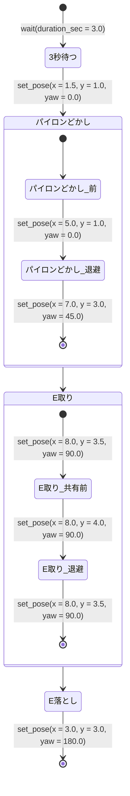

```mermaid
stateDiagram-v2

[*] --> 3秒待つ : wait(duration_sec = 3.0)
3秒待つ --> パイロンどかし : set_pose(x = 1.5, y = 1.0, yaw = 0.0)
パイロンどかし --> E取り
E取り --> E落とし
E落とし --> [*] : set_pose(x = 3.0, y = 3.0, yaw = 180.0)

state パイロンどかし {
    [*] --> パイロンどかし_前
    パイロンどかし_前 --> パイロンどかし_退避 : set_pose(x = 5.0, y = 1.0, yaw = 0.0)
    パイロンどかし_退避 --> [*] : set_pose(x = 7.0, y = 3.0, yaw = 45.0)
}

state E取り {
    [*] --> E取り_共有前 : set_pose(x = 8.0, y = 3.5, yaw = 90.0)
    E取り_共有前 --> E取り_退避 : set_pose(x = 8.0, y = 4.0, yaw = 90.0)
    E取り_退避 --> [*] : set_pose(x = 8.0, y = 3.5, yaw = 90.0)
}
```